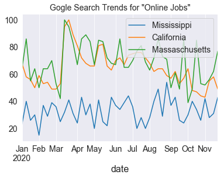
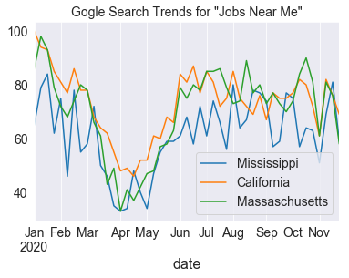

# Job-Searches-vs-Covid-Cases-Analysis

## General Info and Data Sources

In the Google Trends Analysis notebook, I have downloaded the Google Search popularity for online and in person jobs and compared against the Covid-19 cases in US. 

I have utilized pytrends to get search popularity from Google:  https://pypi.org/project/pytrends/

Covid-19 cases in US is obtained from: https://covidtracking.com/data/download

## Results

### General Comparison of Online vs In Person Job Searches

Corona cases peaking as known to everyone. The online job searches has peaked in Mid July and went down to pre-covid lockdown levels recently, signifying that general populations interest in looking for online jobs may settled. However, the searches for "jobs near me" is at the initial lockdown level shock in March, signifying the increasing number Covid-19 cases (along with the holiday season) is creating low demand for job search. 

### Comparison across 3 states for online jobs

California, thanks to Silicon Valley, and Massacchusstes have had a surge in searches for online jobs after the Covid-19 lockdowns started, which is not suprising given the population dynamics of urban, highly educated young millenials. On the other hand, more rural state such as Mississippi has not seen any surge in searches in "online job". I am curious to examine the reasons. 

### Comparison across 3 states for in person jobs

3 states, CA, MA and MS have a very similary dynamics on the searches of "Jobs Near Me" which dips after the lockdowns but still did not recovered yet to pre-covid levels. 

